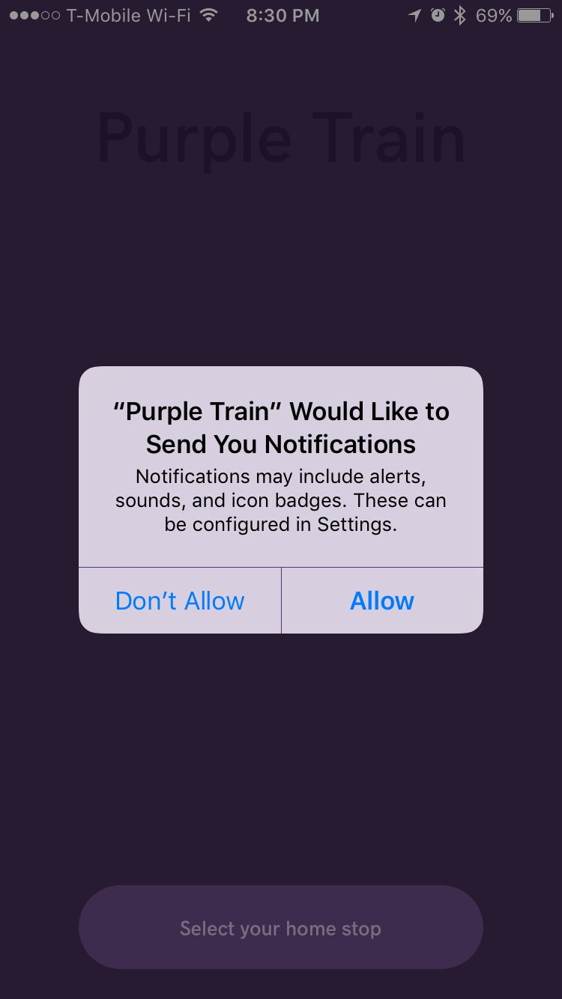

# Push Notifications in elm-native-ui

## Ian C. Anderson
## thoughtbot

---

# Purple Train

- Free MBTA Commuter Rail app for iOS, Android
- Was React Native, now elm-native-ui
- Open source!
  - github.com/thoughtbot/PurpleTrainElm


---

## elm-native-ui

- Experimental!
- Write mobile apps in elm
- (Currently) built on top of React Native

---

## MBTA Alerts

- Your train is cancelled!
- Want to know before going to the station


---

## Push Notifications

In order to send push notifications to a particular device, we need its "device token"



---

# React Native Example

```js
import { PushNotificationIOS } from 'react-native';

PushNotificationIOS.addEventListener('register', (deviceToken) => {
  // Called if the user taps "Allow" on permission dialog
  // Send token to server so we can notify later
});
PushNotificationIOS.addEventListener('registrationError', console.log);

// Opens the permissions dialog if user hasn't seen it yet
PushNotificationIOS.requestPermissions();
```

---

# Let's elmify this!

- Need to write a "native" elm module:
  - Elm module that defines the interface for the library
  - Elm module calls into custom JavaScript module that wraps `PushNotificationIOS`

---

# Elm Module

```elm
-- src/NativeApi/PushNotifications.elm
module NativeApi.PushNotificationIOS exposing (register)

import Native.NativeUi.PushNotificationIOS
import Task exposing (Task)

register : Task String String
register =
    Native.NativeUi.PushNotificationIOS.register
```

---

# JS implementation

```js
// src/Native/NativeUi/PushNotificationIOS.js
const _ohanhi$elm_native_ui$Native_NativeUi_PushNotificationIOS = function () {
  const { PushNotificationIOS } = require("react-native");

  function register() {
    // Need to return a `Task String String`
  }

  return {
    register,
  };
}();
```

---

# JS implementation

```js
// body of register function
return _elm_lang$core$Native_Scheduler.nativeBinding(function(callback) {
  PushNotificationIOS.addEventListener('register', token => {
    callback(_elm_lang$core$Native_Scheduler.succeed(token));
  });

  PushNotificationIOS.addEventListener('registrationError', e => {
    callback(_elm_lang$core$Native_Scheduler.fail(e.message));
  });

  PushNotificationIOS.requestPermissions();
});
```

---

# Use it in the app!

```elm
import NativeApi.PushNotificationIOS as PushNotificationIOS exposing (register)
import Task

-- attempt : (Result x a -> msg) -> Task x a -> Platform.Cmd.Cmd msg
Task.attempt ReceivePushToken register
```

---

# Handle task response


```elm
-- In update function:
ReceivePushToken result ->
    case result of
        Ok tokenString ->
            ( { model | deviceToken = Just (DeviceToken tokenString) }
            , receiveDeviceToken model.selectedStop (DeviceToken
tokenString)
            )

        Err registerError ->
            Debug.crash registerError
```

---

# Send token to server

```elm
receiveDeviceToken : Maybe Stop -> DeviceToken -> Cmd Msg
receiveDeviceToken maybeStop deviceToken =
    case maybeStop of
        Just stop ->
            upsertInstallation stop deviceToken

        Nothing ->
            Cmd.none
```

---

# It works!

But it's rude!


---

# Pre-prompt


---

# React Native Alert

```js
const promptForCancellationsNotifications = () => {
  Alert.alert(
    'This is what it sounds like when trains cry',
    'Purple Train can send you notifications when your trains are cancelled!',
    [
      { text: 'Not Now' },
      { text: 'Give Access', onPress: PushNotificationIOS.requestPermissions },
    ],
  );
};
```

---

# Elmified alerts!

```elm
module NativeUi.Alert exposing (alert)

import Native.NativeUi.Alert
import Task exposing (Task)

type alias AlertButton =
    { text : String
    , value : Bool
    }

alert : String -> String -> List AlertButton -> Task String Bool
alert =
    Native.NativeUi.Alert.alert
```

---

# JS Implementation

```js
const _ohanhi$elm_native_ui$Native_NativeUi_Alert = function () {
  const { Alert } = require("react-native");
  const toArray = _elm_lang$core$Native_List.toArray;
  const unit = { ctor: "_Tuple0" };

  function alert(title, message, buttons) {
    // TODO: Return a task
  }

  return {
    alert: F3(alert),
  };
}();
```

---


# JS Implementation

```js
// Return a task that succeeds with the value of the pressed button
return _elm_lang$core$Native_Scheduler.nativeBinding(function(callback) {
  const buttonArray = toArray(buttons).map(function(button) {
    const { text, value } = button;

    return {
      text,
      onPress: () => {
        callback(_elm_lang$core$Native_Scheduler.succeed(value));
      },
    };
  });

  Alert.alert(title, message, buttonArray);
});
```

---

# Pre-prompt in elm!


```elm
import NativeUi.Alert exposing (alert)

prePromptForPushNotifications : Cmd Msg
prePromptForPushNotifications =
    Task.attempt ReceivePushPrePromptResponse <|
        alert
            "This is what it sounds like when trains cry"
            "Purple Train can send you notifications when your trains are cancelled!"
            [ { text = "Not Now", value = False }
            , { text = "Give Access", value = True }
            ]
```

---

# Handle pre-prompt response

```elm
-- In update function:
ReceivePushPrePromptResponse result ->
    ( model, handlePushPrePromptResponse result )

handlePushPrePromptResponse : Result NativeAlert.Error Bool -> Cmd Msg
handlePushPrePromptResponse result =
    case result of
        Ok True ->
            Task.attempt ReceivePushToken register

        _ ->
            Cmd.none
```

---

# Takeaways

To write an elm-native-ui app, need to contribute code.
Contributing to `elm-native-ui` isn't scary or hard!
Try it out for yourself!
